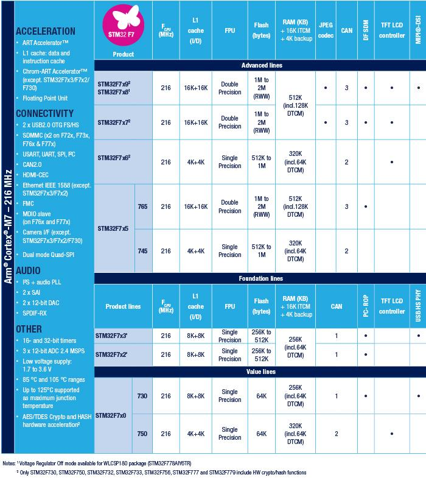

# [STM32F7](https://github.com/mcuyun/STM32F7) 
 
#### 厂商：[ST](https://github.com/sochub/ST) 
#### 架构：[Cortex M7](https://github.com/sochub/CM7) 
## [描述](https://github.com/sochub/STM32F7/wiki) 

 

###  [收录产品](https://github.com/sochub/STM32F7)  

* [STM32F730](https://github.com/sochub/STM32F730) 
* [STM32F765](https://github.com/sochub/STM32F765) 

### [选型建议](https://github.com/sochub)

##  [SoC资源平台](http://www.qitas.cn)   

