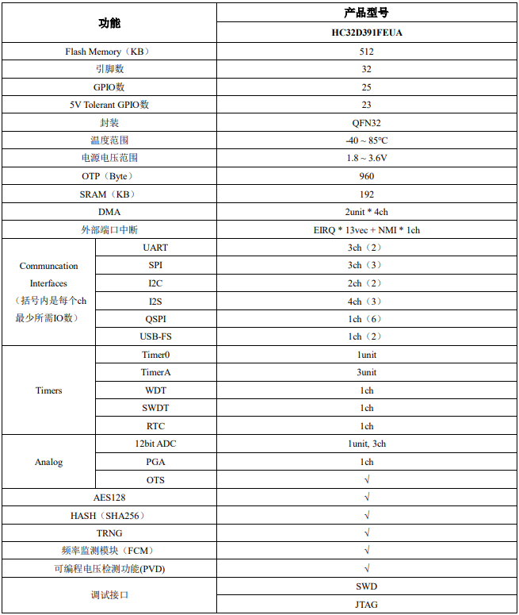

# [HC32D391](https://github.com/SoCXin/HC32D391)

* [hdsc](https://www.hdsc.com.cn/)：[ARMv7-M:Cortex-M4](https://github.com/SoCXin/Cortex)
* [L4R4](https://github.com/SoCXin/Level)：200MHz , 250DMIPS, [680Coremarks](https://www.eembc.org/coremark/scores.php)

## [简介](https://github.com/SoCXin/HC32D391/wiki)

[HC32D391](https://www.hdsc.com.cn/Category83-1499)

#### 关键特性

* 4xI2S，内置音频 PLL支持音频级采样精度
* 12bit 2.5MSPS ADC
* USB 2.0 FS
* 192KB SRAM, 512KB Flash
* QSPI: 200Mbps XIP
* 3xUSART
* 可编程增益放大器（PGA）

### [资源收录](https://github.com/SoCXin)

* [参考资源](src/)
* [参考文档](docs/)
* [参考工程](project/)

### [选型建议](https://github.com/SoCXin)

[HC32D391](https://github.com/SoCXin/HC32D391)

* QFN32 (4×4mm)
###  [探索芯世界 www.SoC.xin](http://www.SoC.Xin)
