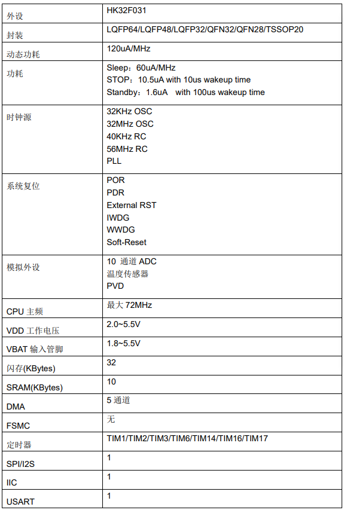

# [HK32F031](https://github.com/SoCXin/HK32F031)

#### [Vendor](https://github.com/SoCXin/Vendor)：[HK](http://www.hsxp-hk.com/)
#### [Core](https://github.com/SoCXin/Cortex)：[Cortex M0](https://github.com/SoCXin/CM0)
#### [Level](https://github.com/SoCXin/Level)：72MHz

## [HK32F031简介](https://github.com/SoCXin/HK32F031/wiki)

[HK32F031](https://github.com/SoCXin/HK32F031)

### [资源组成](https://github.com/SoCXin/HK32F031)

* [文档](docs/)
* [资源](src/)

### [选型建议](https://github.com/SoCXin)

[HK32F031](https://github.com/SoCXin/HK32F031)

###  [SoC芯平台](http://www.SoC.Xin)
